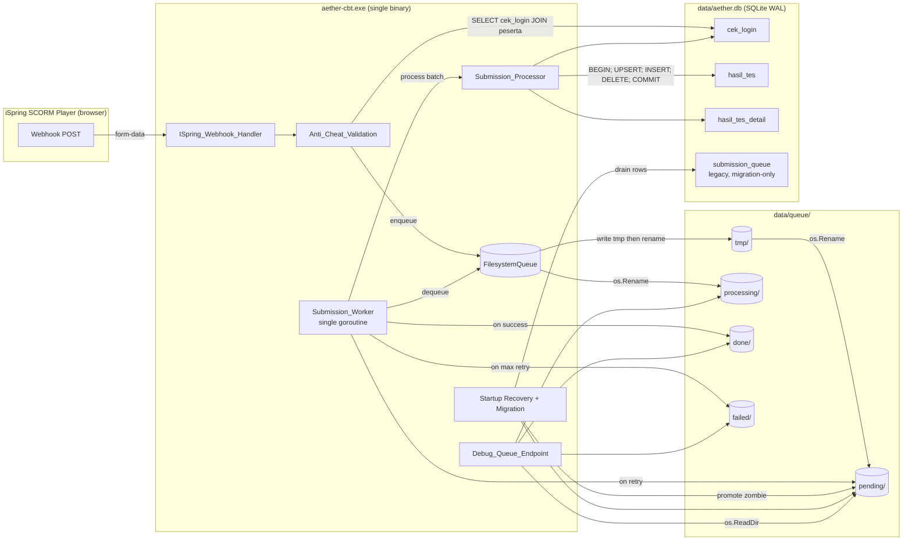
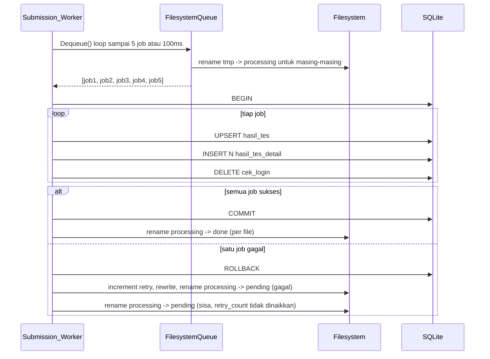
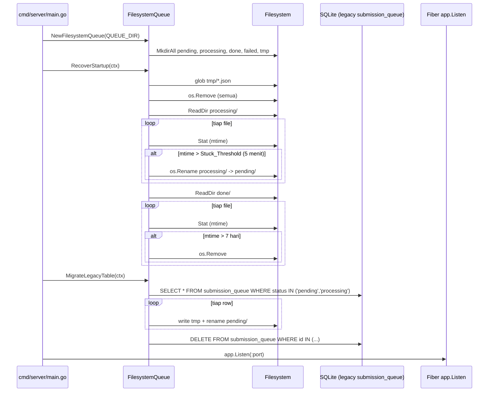

# Design Document

## Overview

Fitur ini menggantikan tabel SQLite `submission_queue` dengan antrean berbasis filesystem (satu file JSON per submission, distempel di direktori `pending/`, `processing/`, `done/`, `failed/`, dan `tmp/`) yang dioperasikan dengan `os.Rename` atomic. Bersamaan dengan itu, validasi anti-cheat sinkron dipulihkan di handler webhook, penulisan hasil dibungkus dalam satu transaksi atomic, worker diberi panic recovery, dan recovery startup ditambahkan untuk job zombie.

Tujuan utama (Requirement 13) adalah 100% E2E success rate pada burst hingga 500 siswa concurrent dengan drain di bawah 5 menit dan throughput ≥ 3 job/detik. Solusi ini WAJIB mempertahankan konstrain produk (Requirement 16): single binary `aether-cbt.exe`, offline-first di LAN sekolah, tanpa service eksternal tambahan.

### Rasional Memilih Filesystem Queue

Hasil load test E2E (`tests/load/E2E_RESULTS.md`) menunjukkan tabel `submission_queue` di SQLite WAL menderita kontensi tulis berat saat burst:

- Worker memegang transaksi tulis untuk dequeue + INSERT `hasil_tes` + INSERT N `hasil_tes_detail` + DELETE `cek_login`. Dalam skema SQLite WAL, hanya satu writer aktif pada satu waktu, dan handler webhook yang sedang `INSERT INTO submission_queue` ikut antri di lock yang sama.
- Akibatnya P95 handler tinggi, sebagian webhook gagal di rate-limiter atau timeout di iSpring, dan job stuck di `processing` saat worker crash.

Filesystem queue memisahkan jalur tulis antrean (handler → file di `pending/`) dari jalur tulis hasil (worker → tabel `hasil_tes`). Hanya satu jenis tulis SQLite yang aktif pada satu waktu (worker), sehingga handler tidak pernah berebut lock dengan worker. File JSON dengan rename atomic memberikan persistence, FIFO ordering via timestamp dalam nama file, dan visibilitas operasional via File Explorer (admin awam dapat membuka file `failed/` dengan Notepad).

### Sumber Eksternal yang Dipakai

- `os.Rename` di Go: dokumentasi Go menyatakan operasi ini atomik untuk file pada volume yang sama di POSIX dan Windows (`MOVEFILE_REPLACE_EXISTING` semantik). Pola `tmp/` + rename adalah teknik standar (lihat Postfix mail queue, Maildir delivery).
- modernc.org/sqlite (driver pure-Go yang dipakai aether-cbt) mendukung `ON CONFLICT DO UPDATE` (UPSERT). UNIQUE index `idx_hasil_tes_unique_validasi` pada `(tenant_id, validasi)` sudah ada di migrasi `017_create_exam_upsert_indexes.sql` sehingga UPSERT dapat dipakai langsung.
- iSpring webhook payload: form fields `sid` / `USER_NAME`, `sp` (score), `tp` (max), `dr` (XML detail), plus `attempt_token` / `AETHER_ATTEMPT_TOKEN` yang disuntikkan harness.

## Architecture

### Component Diagram



### Lifecycle Sub-direktori

```
data/queue/
├── tmp/         # Buffer write-then-rename. Dibersihkan saat startup (Requirement 7.5).
├── pending/     # Job menunggu diproses. FIFO via sort filename.
├── processing/  # Job sedang diproses worker. Mtime > 5 menit = zombie.
├── done/        # Job sukses. Cleanup file > 7 hari di startup.
└── failed/      # Dead letter (retry_count >= Max_Retries). Tidak auto-cleanup.
```

### Sequence: Happy Path (Single Submission)

```mermaid
sequenceDiagram
    participant iSpring
    participant Handler as ISpring_Webhook_Handler
    participant DB as SQLite cek_login
    participant FQ as FilesystemQueue
    participant FS as Filesystem
    participant Worker as Submission_Worker
    participant Proc as Submission_Processor

    iSpring->>Handler: POST /api/ispring/webhook<br/>(sid, sp, tp, dr, attempt_token)
    Handler->>Handler: parse form, basic validation
    Handler->>DB: SELECT cek_login JOIN peserta
    DB-->>Handler: peserta_id, mapel_id, attempt_token, login_time
    Handler->>Handler: constant-time compare token
    Handler->>Handler: parse detail_xml (jika non-empty)
    Handler->>FQ: Enqueue(job)
    FQ->>FS: write tmp/<name>.json
    FQ->>FS: os.Rename tmp/ -> pending/
    FQ-->>Handler: nil
    Handler-->>iSpring: 200 "Result received successfully"

    loop Worker poll
        Worker->>FQ: Dequeue()
        FQ->>FS: ReadDir(pending), sort, pick oldest
        FQ->>FS: os.Rename pending/ -> processing/
        FQ-->>Worker: job
        Worker->>Proc: Process(job)
        Proc->>DB: BEGIN; UPSERT hasil_tes; INSERT N hasil_tes_detail; DELETE cek_login; COMMIT
        Proc-->>Worker: nil
        Worker->>FQ: MarkCompleted
        FQ->>FS: os.Rename processing/ -> done/
    end
```

### Sequence: Batch Processing



Catatan batching: jika satu job dalam batch gagal (Requirement 17.4), seluruh transaksi rollback. Job yang gagal mendapat increment `retry_count` dan `last_error`. Job lain dalam batch yang sebenarnya tidak rusak juga dipindahkan kembali ke `pending/`, tetapi `retry_count` mereka **tidak** dinaikkan karena kegagalan bukan disebabkan oleh job tersebut. Hal ini menghindari hukuman ganda pada job sehat dan tetap konsisten dengan semantik atomic batch.

### Sequence: Crash Recovery saat Startup



Recovery + migrasi WAJIB selesai sebelum `app.Listen` dipanggil (Requirement 7.3). Tidak ada batas waktu: walau migrasi 5000 baris memakan beberapa detik, server tidak listen sampai pemindaian kelar.

### Wiring di `cmd/server/main.go` (perubahan minimal)

```go
queueDir := os.Getenv("QUEUE_DIR")
if queueDir == "" {
    queueDir = "data/queue"
}

fsQueue, err := submission.NewFilesystemQueue(queueDir)
if err != nil {
    log.Fatalf("failed to init filesystem queue: %v", err)
}

if err := fsQueue.RecoverStartup(ctx); err != nil {
    log.Fatalf("filesystem queue recovery failed: %v", err)
}

if err := fsQueue.MigrateLegacyTable(ctx, db.DB); err != nil {
    log.Fatalf("legacy submission_queue migration failed: %v", err)
}

processor := submission.NewProcessor(db.DB)
worker := submission.NewWorker(fsQueue, processor.Process)
handlers.SetSubmissionQueue(fsQueue)

go worker.Run(ctx)
defer worker.Stop()
// ... lalu app.Listen
```

## Components and Interfaces

### `FilesystemQueue` (baru di `internal/submission/fsqueue.go`)

`FilesystemQueue` mengimplementasikan interface `Queue` yang sudah ada (`Enqueue`, `Dequeue`, `MarkCompleted`, `MarkFailed`, `GetStats`) sehingga dapat dipasang ke `Worker` dan handler tanpa mengubah signature publik.

```go
package submission

import (
    "context"
    "database/sql"
    "encoding/json"
    "errors"
    "fmt"
    "os"
    "path/filepath"
    "sort"
    "time"
)

// FilesystemQueue menyimpan setiap SubmissionJob sebagai file JSON di sub-direktori
// pending/, processing/, done/, failed/. Operasi state-transition dilakukan dengan
// os.Rename atomic untuk menghindari job hilang saat crash.
type FilesystemQueue struct {
    root          string // QUEUE_DIR, mis. data/queue
    pendingDir    string
    processingDir string
    doneDir       string
    failedDir     string
    tmpDir        string

    maxRetries     int           // default 5
    stuckThreshold time.Duration // default 5 * time.Minute
    doneRetention  time.Duration // default 7 * 24 * time.Hour
}

// NewFilesystemQueue membuat sub-direktori jika belum ada (Requirement 1.6, 9.3).
// Mengembalikan error jika direktori tidak dapat ditulis.
func NewFilesystemQueue(root string) (*FilesystemQueue, error)

// Enqueue menulis job ke tmp/, lalu rename atomic ke pending/.
// Implementasi memenuhi Requirement 1.1, 1.2, 1.3, 1.4, 1.5.
func (q *FilesystemQueue) Enqueue(ctx context.Context, job *SubmissionJob) error

// Dequeue memilih file paling lama di pending/ (FIFO via sort filename),
// memindahkannya ke processing/, lalu mengembalikan job yang sudah di-unmarshal.
// Mengembalikan (nil, nil) jika pending kosong.
// Implementasi memenuhi Requirement 2.1, 2.2, 2.3, 2.4.
func (q *FilesystemQueue) Dequeue(ctx context.Context) (*SubmissionJob, error)

// DequeueBatch mengambil hingga maxBatch file dari pending/ secara FIFO.
// Dipakai oleh Worker dalam mode batching (Requirement 17.3).
// Mengembalikan slice kosong jika pending kosong (bukan error).
func (q *FilesystemQueue) DequeueBatch(ctx context.Context, maxBatch int) ([]*SubmissionJob, error)

// MarkCompleted memindahkan file dari processing/ ke done/.
// Implementasi memenuhi Requirement 2.5.
func (q *FilesystemQueue) MarkCompleted(ctx context.Context, jobID int64) error

// MarkFailed menambah retry_count, mengisi last_error, lalu:
//   - jika retry_count < maxRetries: rewrite file via tmp/, rename ke pending/.
//   - jika retry_count >= maxRetries: rewrite + rename ke failed/.
// Implementasi memenuhi Requirement 3.1, 3.2, 3.4, 3.5.
func (q *FilesystemQueue) MarkFailed(ctx context.Context, jobID int64, processErr error) error

// GetStats menghitung jumlah file *.json di tiap direktori.
// Implementasi memenuhi Requirement 12.1, 12.2.
func (q *FilesystemQueue) GetStats(ctx context.Context) (QueueStats, error)

// RecoverStartup memindai processing/ untuk file mtime > stuckThreshold dan
// mempromosikannya ke pending/. Membersihkan tmp/ dan menghapus file done/ > 7 hari.
// Implementasi memenuhi Requirement 7.1, 7.2, 7.4, 7.5.
func (q *FilesystemQueue) RecoverStartup(ctx context.Context) error

// MigrateLegacyTable menarik baris pending/processing dari tabel submission_queue
// dan menulis ulang sebagai file di pending/. Setelah semua sukses, baris asli
// di-DELETE dalam transaksi tunggal. Implementasi memenuhi Requirement 8.
func (q *FilesystemQueue) MigrateLegacyTable(ctx context.Context, db *sql.DB) error
```

#### Algoritma Inti (pseudocode)

`Enqueue(job)`:
```
1. now := time.Now().UTC()
2. job.EnqueuedAt = now
3. nameNoSuffix := fmt.Sprintf("%d-%d-%s", now.UnixNano(), job.TenantID, sanitize(job.NoID))
4. suffix := randomHex(8)
5. fileName := nameNoSuffix + "-" + suffix + ".json"
6. data, _ := MarshalJob(job)
7. tmpPath := filepath.Join(tmpDir, fileName)
8. f, err := os.OpenFile(tmpPath, O_WRONLY|O_CREATE|O_EXCL, 0644)
9. write data, fsync (optional, default off untuk perf), close
10. dstPath := filepath.Join(pendingDir, fileName)
11. err := os.Rename(tmpPath, dstPath)
12. if err: os.Remove(tmpPath); return err
13. return nil
```

`Dequeue()`:
```
1. entries := os.ReadDir(pendingDir)  // sudah terurut nama (Go 1.21+)
2. for entry in entries (sudah sort by name):
3.     if !strings.HasSuffix(entry.Name(), ".json"): continue
4.     src := filepath.Join(pendingDir, entry.Name())
5.     dst := filepath.Join(processingDir, entry.Name())
6.     err := os.Rename(src, dst)
7.     if errors.Is(err, fs.ErrNotExist): continue  // race: worker lain ambil
8.     if err != nil: return nil, err
9.     data, err := os.ReadFile(dst)
10.    if err: return nil, err  // file rusak -> dead letter di sini juga
11.    job, err := UnmarshalJob(data)
12.    job.fileName = entry.Name()  // disimpan untuk MarkCompleted/Failed
13.    return job, nil
14. return nil, nil
```

`os.ReadDir` di Go 1.21+ mengembalikan entri yang sudah terurut by name (sumber: pkg.go.dev `os.ReadDir`). Karena prefix nama file adalah `<unix_nano_timestamp>-`, sort by name = sort by waktu enqueue = FIFO. Tidak perlu `sort.Slice` tambahan.

`MarkFailed(jobID, err)`:
```
1. file := jobs[jobID].fileName  // disimpan di-memori; alternatif: scan processing
2. data := os.ReadFile(filepath.Join(processingDir, file))
3. job := UnmarshalJob(data)
4. job.RetryCount++
5. job.LastError = err.Error()
6. job.EnqueuedAt = time.Now().UTC()  // refresh untuk fairness
7. newData := MarshalJob(job)
8. tmpPath := filepath.Join(tmpDir, file)
9. write newData, fsync, close
10. var dstDir string
11. if job.RetryCount >= maxRetries: dstDir = failedDir
12. else: dstDir = pendingDir
13. err := os.Rename(tmpPath, filepath.Join(dstDir, file))
14. if err: os.Remove(tmpPath); return err
15. os.Remove(filepath.Join(processingDir, file))  // cleanup; file lama
```

Catatan: nama file tetap sama saat retry agar admin yang pantau via File Explorer melihat satu file pindah lokasi (bukan dua file beda nama). Ini memudahkan korelasi.

#### Identifikasi Job tanpa ID Numerik

Interface `Queue` memakai `jobID int64`. `FilesystemQueue` tidak punya ID numerik alami. Solusi: `SubmissionJob.ID` digunakan sebagai handle in-memory (hash dari nama file, atau index yang ditugaskan saat dequeue). Worker hanya butuh ID untuk memanggil `MarkCompleted(jobID)` / `MarkFailed(jobID)`. Implementasi:

```go
type FilesystemQueue struct {
    // ... field di atas
    inFlight map[int64]string // jobID -> fileName
    nextID   int64
    mu       sync.Mutex
}
```

Saat Dequeue: assign `nextID`, simpan mapping ke `inFlight`. Saat Mark*: lookup, lalu hapus dari map. Aman karena hanya satu worker yang melakukan dequeue dalam satu waktu.

### Worker (modifikasi `internal/submission/worker.go`)

Tambahan dari implementasi existing: panic recovery (Requirement 6) dan batching (Requirement 17.3).

```go
type Worker struct {
    queue       Queue
    processFunc func(ctx context.Context, jobs []*SubmissionJob) error // batch
    stopChan    chan struct{}

    batchSize    int           // default 5
    batchTimeout time.Duration // default 100 * time.Millisecond
}

func NewWorker(q Queue, processBatch func(ctx context.Context, jobs []*SubmissionJob) error) *Worker

func (w *Worker) Run(ctx context.Context) {
    for {
        select {
        case <-w.stopChan: return
        case <-ctx.Done():  return
        default:
        }

        batch, err := w.collectBatch(ctx)
        if err != nil {
            log.Printf("[WORKER] dequeue error: %v", err)
            time.Sleep(1 * time.Second)
            continue
        }
        if len(batch) == 0 {
            time.Sleep(500 * time.Millisecond)
            continue
        }
        w.processBatchSafe(ctx, batch)
    }
}

// collectBatch mencoba mengumpulkan hingga batchSize job dengan timeout batchTimeout.
func (w *Worker) collectBatch(ctx context.Context) ([]*SubmissionJob, error) {
    deadline := time.Now().Add(w.batchTimeout)
    var batch []*SubmissionJob
    for len(batch) < w.batchSize {
        if time.Now().After(deadline) && len(batch) > 0 { break }
        job, err := w.queue.Dequeue(ctx)
        if err != nil { return batch, err }
        if job == nil {
            if len(batch) > 0 { return batch, nil }
            return nil, nil
        }
        batch = append(batch, job)
    }
    return batch, nil
}

// processBatchSafe membungkus pemanggilan dengan defer recover (Requirement 6.1, 6.2).
func (w *Worker) processBatchSafe(ctx context.Context, batch []*SubmissionJob) {
    defer func() {
        if r := recover(); r != nil {
            stack := debug.Stack()
            log.Printf("[WORKER] PANIC recovered: %v\n%s", r, stack)
            for _, job := range batch {
                _ = w.queue.MarkFailed(ctx, job.ID, fmt.Errorf("worker panic: %v", r))
            }
        }
    }()

    err := w.processFunc(ctx, batch)
    if err == nil {
        for _, job := range batch {
            if mErr := w.queue.MarkCompleted(ctx, job.ID); mErr != nil {
                log.Printf("[WORKER] MarkCompleted job=%d: %v", job.ID, mErr)
            }
        }
        return
    }
    log.Printf("[WORKER] batch process error: %v", err)
    for _, job := range batch {
        if mErr := w.queue.MarkFailed(ctx, job.ID, err); mErr != nil {
            log.Printf("[WORKER] MarkFailed job=%d: %v", job.ID, mErr)
        }
    }
}
```

### Processor (modifikasi `internal/submission/processor.go`)

`Processor.Process` direvisi untuk: (a) menerima batch, (b) menjalankan satu transaksi mencakup seluruh batch, (c) UPSERT untuk idempotency, (d) tidak mengulang validasi anti-cheat (sudah dilakukan handler).

```go
type Processor struct {
    db *sql.DB
}

func NewProcessor(db *sql.DB) *Processor

// ProcessBatch menulis hasil untuk seluruh batch dalam satu transaksi.
// Memenuhi Requirement 5.1, 5.2, 5.3, 5.4, 5.5, 14.1, 14.3, 17.3, 17.4.
func (p *Processor) ProcessBatch(ctx context.Context, jobs []*SubmissionJob) error {
    tx, err := p.db.BeginTx(ctx, nil)
    if err != nil { return fmt.Errorf("begin tx: %w", err) }
    defer tx.Rollback()

    for _, job := range jobs {
        if err := p.processOneInTx(ctx, tx, job); err != nil {
            return err  // rollback otomatis via defer
        }
    }
    return tx.Commit()
}

// processOneInTx tidak melakukan validasi cek_login (sudah di handler).
// Lakukan: lookup peserta_id+mapel_id, UPSERT hasil_tes, replace hasil_tes_detail,
// DELETE cek_login. Semua dalam tx yang dipassed.
func (p *Processor) processOneInTx(ctx context.Context, tx *sql.Tx, job *SubmissionJob) error
```

`Submission_Job.Validasi` di handler diisi sebagai `<tenant_id>_<no_id>_<mapel_id>` untuk match constraint UNIQUE existing `idx_hasil_tes_unique_validasi (tenant_id, validasi)`. Saat ini handler memakai `<tenant_id>_<no_id>` (tanpa mapel_id). Ini akan diperbaiki di handler agar konsisten dengan skema dan Requirement 14.2.

### Handler (modifikasi `internal/api/handlers/ispring.go`)

Validasi anti-cheat sinkron dipulihkan (Requirement 4). Hanya satu SELECT yang join `cek_login` + `peserta` (Requirement 4.7).

```go
func ISpringWebhook(c *fiber.Ctx) error {
    tenantID := c.Locals("tenant_id").(int)

    noID := strings.TrimSpace(c.FormValue("sid"))
    if noID == "" { noID = strings.TrimSpace(c.FormValue("USER_NAME")) }
    if noID == "" {
        return c.Status(fiber.StatusBadRequest).SendString("Missing student identifier (sid / USER_NAME)")
    }

    score := c.FormValue("sp")
    maxScore := c.FormValue("tp")
    detailXML := c.FormValue("dr")
    attemptToken := c.FormValue("attempt_token")
    if attemptToken == "" { attemptToken = c.FormValue("AETHER_ATTEMPT_TOKEN") }

    // Single SELECT: cek_login JOIN peserta (Requirement 4.7).
    var pesertaID, mapelID int
    var expectedToken string
    err := db.DB.QueryRowContext(c.Context(), `
        SELECT p.id, cl.mapel_id, COALESCE(cl.attempt_token, '')
          FROM peserta p
          JOIN cek_login cl ON cl.peserta_id = p.id AND cl.tenant_id = p.tenant_id
         WHERE p.tenant_id = ? AND p.no_id = ?
         LIMIT 1
    `, tenantID, noID).Scan(&pesertaID, &mapelID, &expectedToken)
    if errors.Is(err, sql.ErrNoRows) {
        return c.Status(fiber.StatusForbidden).SendString("active session not found")
    }
    if err != nil {
        return c.Status(fiber.StatusInternalServerError).SendString("session lookup failed")
    }
    if expectedToken == "" || subtle.ConstantTimeCompare([]byte(attemptToken), []byte(expectedToken)) != 1 {
        return c.Status(fiber.StatusForbidden).SendString("invalid attempt token")
    }
    if detailXML != "" {
        if _, err := ispringparser.ParseDetailedResults(detailXML); err != nil {
            return c.Status(fiber.StatusBadRequest).SendString("Invalid iSpring detailed results XML")
        }
    }

    job := &submission.SubmissionJob{
        TenantID:     tenantID,
        NoID:         noID,
        Score:        score,
        MaxScore:     maxScore,
        DetailXML:    detailXML,
        AttemptToken: attemptToken,
        Validasi:     fmt.Sprintf("%d_%s_%d", tenantID, noID, mapelID),
    }
    if err := SubmissionQueue.Enqueue(c.Context(), job); err != nil {
        return c.Status(fiber.StatusInternalServerError).SendString("Failed to queue result")
    }
    return c.SendString("Result received successfully")
}
```

### Debug Queue Endpoint (modifikasi `internal/api/handlers/debug_queue.go`)

Tetap memakai `Queue.GetStats()`. Karena `FilesystemQueue.GetStats` membaca empat direktori, handler tidak perlu perubahan struktural; cukup memastikan ia mengembalikan `done_count` juga (saat ini hanya `pending/processing/failed`).

`QueueStats` ditambah `DoneCount`:

```go
type QueueStats struct {
    PendingCount    int `json:"pending_count"`
    ProcessingCount int `json:"processing_count"`
    FailedCount     int `json:"failed_count"`
    DoneCount       int `json:"done_count"`  // baru, Requirement 12.1
}
```

### Backward Compatibility

- `internal/submission/queue.go`: `InMemoryQueue`, `SQLiteQueue`, dan `BufferedSQLiteQueue` **tetap ada** namun ditandai deprecated dengan komentar `// Deprecated: use FilesystemQueue. Dipertahankan untuk test fixture lama.`. Tidak dihapus karena beberapa unit test mungkin masih memakainya.
- Tabel `submission_queue` di skema **tetap dipertahankan** (Requirement 16.3). Migrasi data berjalan sekali saat startup setelah upgrade; tabel dibiarkan kosong setelahnya. Penghapusan tabel adalah keputusan rilis berikutnya.
- `Worker` lama menerima `processFunc func(ctx, *SubmissionJob) error`. Untuk batching kita perlu signature batch. Strategi: tambah `NewWorkerBatch(q, processBatch)` constructor baru, dan biarkan `NewWorker` lama wrap `processFunc` ke batch-of-1. `cmd/server/main.go` dimigrasi untuk memakai `NewWorkerBatch`.

## Data Models

### `SubmissionJob` (modifikasi `internal/submission/job.go`)

Field DB-only (`ID`, `Status`, `CreatedAt`, `UpdatedAt`, `NextRetryAt`) tetap ada untuk kompatibilitas legacy dengan tag JSON `omitempty`. Field baru: `EnqueuedAt`. Field lama disisihkan dari serialisasi `Job_File` melalui `MarshalJob`.

```go
type SubmissionJob struct {
    // Field yang ditulis ke Job_File (Requirement 10.1, urutan tetap):
    Validasi     string    `json:"validasi"`
    TenantID     int       `json:"tenant_id"`
    NoID         string    `json:"no_id"`
    Score        string    `json:"score"`
    MaxScore     string    `json:"max_score"`
    AttemptToken string    `json:"attempt_token"`
    EnqueuedAt   time.Time `json:"enqueued_at"`
    RetryCount   int       `json:"retry_count"`
    LastError    string    `json:"last_error"`
    DetailXML    string    `json:"detail_xml"`

    // Field internal (tidak di-serialize ke Job_File):
    ID       int64  `json:"-"`
    fileName string // diisi saat dequeue, dipakai untuk MarkCompleted/Failed
}
```

### Format `Job_File` (Requirement 10)

```json
{
  "validasi": "1_S001_42",
  "tenant_id": 1,
  "no_id": "S001",
  "score": "85",
  "max_score": "100",
  "attempt_token": "a1b2c3d4e5f60718293a4b5c6d7e8f90",
  "enqueued_at": "2026-05-26T07:30:00Z",
  "retry_count": 0,
  "last_error": "",
  "detail_xml": "<results>\n  <question id=\"q1\" status=\"correct\" />\n</results>"
}
```

`detail_xml` di-serialize sebagai string JSON dengan escape standar `encoding/json` (Requirement 10.3). Karakter `<`, `>`, `&` di-escape menjadi `\u003c`, `\u003e`, `\u0026` jika `SetEscapeHTML(true)` (default). Untuk kemudahan baca admin, `SetEscapeHTML(false)` dipakai sehingga XML tetap terbaca.

### `MarshalJob` / `UnmarshalJob` (Requirement 11)

```go
// MarshalJob menghasilkan JSON pretty-printed (indent 2 spasi) dengan urutan field
// tetap sesuai Requirement 10.1. Memenuhi Requirement 11.1, 11.5.
func MarshalJob(job *SubmissionJob) ([]byte, error) {
    var buf bytes.Buffer
    enc := json.NewEncoder(&buf)
    enc.SetEscapeHTML(false)
    enc.SetIndent("", "  ")
    if err := enc.Encode(job); err != nil { return nil, err }
    return buf.Bytes(), nil
}

// UnmarshalJob mem-parse byte JSON menjadi SubmissionJob. Memvalidasi field wajib
// (tenant_id != 0, no_id != "", validasi != "", enqueued_at != zero).
// Memenuhi Requirement 11.2, 11.3.
func UnmarshalJob(data []byte) (*SubmissionJob, error) {
    var job SubmissionJob
    if err := json.Unmarshal(data, &job); err != nil {
        return nil, fmt.Errorf("unmarshal job: %w", err)
    }
    if job.TenantID == 0 {
        return nil, errors.New("missing required field: tenant_id")
    }
    if job.NoID == "" {
        return nil, errors.New("missing required field: no_id")
    }
    if job.Validasi == "" {
        return nil, errors.New("missing required field: validasi")
    }
    if job.EnqueuedAt.IsZero() {
        return nil, errors.New("missing required field: enqueued_at")
    }
    return &job, nil
}
```

### Naming File `Job_File`

Format: `<unix_nano>-<tenant_id>-<no_id>-<8hex>.json`

Contoh: `1748246400000123456-1-S001-a1b2c3d4.json`

Ketentuan:
- `<unix_nano>` adalah `time.Now().UTC().UnixNano()` 19 digit. Padding tidak diperlukan karena semua nilai > 10^18 nano-detik per Mei 2024 dan seterusnya.
- `<tenant_id>` integer apa adanya.
- `<no_id>` di-sanitize: hanya `[A-Za-z0-9_-]` dipertahankan, sisanya diganti `_`. Mencegah path traversal dan karakter ilegal Windows.
- `<8hex>` dari `crypto/rand` 4 byte di-encode hex, mengamankan keunikan saat dua submission burst di nano-detik yang sama (Requirement 1.2).

Sortable by name = sortable by `unix_nano` = FIFO order yang dibutuhkan Requirement 2.1.

### Konfigurasi (Requirement 9)

| Env Var | Default | Catatan |
|---|---|---|
| `QUEUE_DIR` | `data/queue` | Root direktori. `tmp/` harus pada volume yang sama. |
| `QUEUE_MAX_RETRIES` | `5` | `Max_Retries` (opsional, untuk debug). |
| `QUEUE_BATCH_SIZE` | `5` | Maksimal job per transaksi. |
| `QUEUE_BATCH_TIMEOUT_MS` | `100` | Maksimal tunggu untuk mengisi batch. |
| `QUEUE_STUCK_THRESHOLD_MIN` | `5` | `Stuck_Threshold` untuk recovery. |
| `QUEUE_DONE_RETENTION_DAYS` | `7` | Cleanup `done/`. |

## Correctness Properties


*Sebuah property adalah karakteristik atau perilaku yang harus berlaku di seluruh eksekusi valid dari sistem—pernyataan formal tentang apa yang seharusnya dilakukan sistem. Property menjadi jembatan antara spesifikasi yang dibaca manusia dan jaminan kebenaran yang dapat diverifikasi mesin.*

Karena fitur ini menggabungkan kode logis (serialisasi, FIFO ordering, atomicity, idempotency) dengan komponen I/O (filesystem rename, SQLite transaksi), banyak acceptance criteria cocok untuk property-based testing. Properti di bawah berasal dari konsolidasi prework analysis (lihat ringkasan di bawah Testing Strategy).

### Property 1: Enqueue Atomicity dan Penamaan Unik

*For any* `SubmissionJob` valid dan urutan N enqueue terhadap `FilesystemQueue` yang baru dibuat, setelah semua enqueue selesai sukses: (a) `tmp/` kosong, (b) jumlah file `*.json` di `pending/` sama dengan N, (c) tiap file punya nama unik mengikuti format `<unix_nano>-<tenant_id>-<no_id>-<8hex>.json`.

**Validates: Requirements 1.1, 1.2**

### Property 2: Round-trip Serialization

*For any* `SubmissionJob` valid `j`, `UnmarshalJob(MarshalJob(j))` menghasilkan job `j'` yang ekuivalen secara field-by-field dengan `j` (termasuk `detail_xml` yang berisi karakter khusus seperti `<`, `>`, `&`, `\n`, `"`).

**Validates: Requirements 1.5, 10.5, 11.4**

### Property 3: Format Output `MarshalJob`

*For any* `SubmissionJob` valid `j`, output bytes dari `MarshalJob(j)` (a) dapat di-parse ulang oleh `encoding/json` standar tanpa error, (b) menggunakan indent 2 spasi, (c) menempatkan field dalam urutan tetap (`validasi`, `tenant_id`, `no_id`, `score`, `max_score`, `attempt_token`, `enqueued_at`, `retry_count`, `last_error`, `detail_xml`), (d) merepresentasikan `enqueued_at` sebagai string ISO 8601 UTC dengan suffix `Z`.

**Validates: Requirements 10.1, 10.2, 11.5**

### Property 4: Dequeue FIFO dan State Transition

*For any* urutan N enqueue dengan `enqueued_at` acak, dequeue berturut-turut N kali menghasilkan job dalam urutan menaik berdasarkan `enqueued_at`; setelah tiap dequeue, file yang bersangkutan tidak ada di `pending/` dan ada tepat di `processing/`.

**Validates: Requirements 2.1, 2.2**

### Property 5: MarkCompleted Memindahkan ke Done

*For any* job yang baru di-dequeue (sehingga ada di `processing/`), pemanggilan `MarkCompleted(jobID)` menghasilkan invariant: file tidak ada di `processing/`, ada tepat di `done/`, dan isinya identik dengan saat di-dequeue.

**Validates: Requirements 2.5**

### Property 6: MarkFailed Mengikuti Aturan Retry dan Dead Letter

*For any* `SubmissionJob` di `processing/` dengan `retry_count = n` dan error `e` non-nil, setelah `MarkFailed(jobID, e)`:
- jika `n+1 < Max_Retries`, file ada di `pending/` dengan `retry_count = n+1`, `last_error = e.Error()`, dan eligible untuk dequeue setelah `min(2^n, 30)` detik;
- jika `n+1 >= Max_Retries`, file ada di `failed/` dengan `retry_count = n+1` dan `last_error = e.Error()`;
- dalam kedua kasus, file tidak ada di `processing/` maupun di `tmp/`.

**Validates: Requirements 3.1, 3.2, 3.3, 3.4, 3.5**

### Property 7: Handler Happy Path Meng-enqueue Job Valid

*For any* (peserta, mapel, sesi `cek_login` aktif dengan `attempt_token = T`, `detail_xml` parseable atau kosong), POST webhook dengan token yang sama dengan `T` menghasilkan: (a) HTTP 200 dengan body `"Result received successfully"`, (b) tepat satu file baru di `pending/`, (c) job di file tersebut memiliki `tenant_id`, `no_id`, `validasi = <tenant>_<noID>_<mapelID>`, `attempt_token = T`, `score`, `max_score`, dan `detail_xml` yang sama dengan request.

**Validates: Requirements 4.6**

### Property 8: Jumlah Baris Detail Sama dengan Jumlah Pertanyaan

*For any* `SubmissionJob` dengan `detail_xml` yang parseable menjadi N pertanyaan (N >= 0), setelah `Processor.ProcessBatch([job])` sukses, `COUNT(*) FROM hasil_tes_detail WHERE hasil_tes_id = <id>` sama dengan N.

**Validates: Requirements 5.3**

### Property 9: Idempotensi terhadap Reprocessing

*For any* `SubmissionJob` `j` dengan `validasi = v`, memproses `j` dua kali (dengan payload bisa berbeda di score atau detail) menghasilkan invariant: (a) `COUNT(*) FROM hasil_tes WHERE tenant_id = j.TenantID AND validasi = v` sama dengan 1, (b) baris `hasil_tes_detail` mencerminkan payload terakhir, (c) tidak ada baris detail orphan dari payload pertama.

**Validates: Requirements 5.4, 14.1, 14.3, 14.4**

### Property 10: Atomicity Batch

*For any* batch berisi N >= 1 `SubmissionJob` valid yang diproses oleh `Processor.ProcessBatch`:
- jika semua N berhasil, ada N baris baru/diupdate di `hasil_tes` dan transaksi commit dengan tepat satu COMMIT;
- jika tepat satu job gagal (mis. peserta tidak ditemukan), tidak ada perubahan persistent di `hasil_tes` maupun `hasil_tes_detail` (rollback total), dan error dikembalikan ke `Worker`.

**Validates: Requirements 5.1, 5.2, 17.3, 17.4**

### Property 11: Worker Tetap Hidup di Hadapan Panic

*For any* urutan N pemanggilan `processFunc` dengan sebagian acak panic dan sebagian sukses, `Worker.Run` tidak berhenti (loop terus berjalan), job yang panic berakhir di `pending/` (jika `retry_count < max`) atau `failed/` (jika sudah max), dan job sukses berakhir di `done/`.

**Validates: Requirements 6.2, 6.3, 6.4**

### Property 12: Recovery Promosi File Stuck

*For any* state awal `processing/` berisi N file dengan `mtime` acak, setelah `RecoverStartup`: file dengan `mtime` lebih lama dari `Stuck_Threshold` ada di `pending/`; file dengan `mtime` lebih baru tetap di `processing/`; jumlah total file (sum `pending/` + `processing/`) tetap N.

**Validates: Requirements 7.1, 7.2**

### Property 13: Recovery Membersihkan Tmp

*For any* state awal `tmp/` berisi N file (apapun nama atau isinya), setelah `RecoverStartup`: `tmp/` kosong dan jumlah file di sub-direktori lain tidak berkurang.

**Validates: Requirements 7.5**

### Property 14: Migrasi Legacy Lengkap

*For any* state awal tabel `submission_queue` berisi M baris (dengan distribusi status acak), setelah `MigrateLegacyTable`: jumlah file baru di `pending/` sama dengan jumlah baris berstatus `pending` atau `processing` di state awal; baris yang dimigrasi sudah dihapus dari tabel; baris berstatus lain (`completed`, `failed`) tidak tersentuh.

**Validates: Requirements 8.1, 8.2, 8.3**

### Property 15: Debug Counts Match Filesystem

*For any* state queue dengan `n_p` file di `pending/`, `n_pr` di `processing/`, `n_d` di `done/`, `n_f` di `failed/`, response GET `/api/debug/queue` mengembalikan `{pending_count: n_p, processing_count: n_pr, done_count: n_d, failed_count: n_f}`.

**Validates: Requirements 12.1, 12.2**

## Error Handling

### Klasifikasi Error per Lapisan

| Lapisan | Error | Strategi |
|---|---|---|
| Handler validation | `cek_login` tidak ada | HTTP 403 `"active session not found"` (Req 4.2) |
| Handler validation | Token mismatch | HTTP 403 `"invalid attempt token"` (Req 4.3) |
| Handler validation | XML invalid | HTTP 400 `"Invalid iSpring detailed results XML"` (Req 4.4) |
| Handler validation | `no_id` kosong | HTTP 400 `"Missing student identifier (sid / USER_NAME)"` (Req 4.5) |
| Handler enqueue | `os.OpenFile tmp/` gagal (disk full, permission) | HTTP 500 `"Failed to queue result"`, log error path |
| Handler enqueue | `os.Rename tmp/` → `pending/` gagal | HTTP 500, file `tmp/` dibersihkan |
| Worker dequeue | `os.ReadDir` gagal | log, sleep 1s, lanjut loop |
| Worker dequeue | `os.Rename pending/` → `processing/` gagal karena file hilang (race) | continue ke kandidat berikut (Req 2.4) |
| Worker dequeue | File `processing/` tidak bisa di-read | mark failed dengan error `"corrupt job file"` |
| Worker dequeue | `UnmarshalJob` gagal | mark failed dengan error `"invalid job json: <detail>"` (lihat **File Corrupt** di bawah) |
| Worker process | `Processor.ProcessBatch` mengembalikan error | semua job dalam batch `MarkFailed` per Req 17.4 |
| Worker process | Panic | `defer recover`, semua job dalam batch `MarkFailed` dengan error `"worker panic: <msg>"` (Req 6.2) |
| Processor | SQLite `BUSY` / `LOCKED` | error dipropagasi, retry via Req 3 backoff |
| Processor | Constraint violation pada `hasil_tes_detail` | rollback, error dipropagasi |
| Startup | `MkdirAll(QUEUE_DIR/...)` gagal | `log.Fatal`, exit non-zero (Req 9.3) |
| Startup | `RecoverStartup` gagal | `log.Fatal`, exit non-zero |
| Startup | `MigrateLegacyTable` gagal | `log.Fatal`, exit non-zero (Req 8.4: tidak DELETE jika ada row gagal) |

### Edge Cases yang Eksplisit

#### 1. Disk Penuh (`ENOSPC`)

`os.OpenFile` di `tmp/` mengembalikan error syscall yang membungkus `ENOSPC`. Handler menerjemahkan ini menjadi HTTP 500. Operator melihat pesan error di log; tidak ada cara untuk recover otomatis. iSpring akan retry sendiri (atau siswa submit ulang manual). Worker yang sedang `MarkFailed` saat disk penuh: file masih di `processing/`, pada restart akan dipromosikan via `RecoverStartup`.

Mitigasi proaktif: Requirement 12 menyediakan endpoint untuk monitoring; admin sekolah dapat memantau ukuran `data/queue/` via File Explorer.

#### 2. File Corrupt di `processing/` (gagal `UnmarshalJob`)

Skenario: power loss saat file ditulis ke `tmp/` lalu rename setengah jalan (walau rename atomic, isi tmp belum di-fsync). Atau corrupt FS-level (sangat jarang, file shorter than expected).

Strategi: saat `Dequeue` mendapati `UnmarshalJob` gagal, file langsung dipindah ke `failed/` dengan wrapper file `<original>.error.txt` berisi pesan error. Tidak ada retry karena retry tidak akan memperbaiki corrupt content. Admin investigasi manual.

#### 3. Race antara Dequeue dan Recovery

Tidak terjadi karena `RecoverStartup` selesai SEBELUM HTTP listen dan SEBELUM `worker.Run` dipanggil (Req 7.3). Jadi tidak mungkin ada Dequeue concurrent dengan recovery scan.

Race lain: file di `processing/` saat startup yang `mtime`-nya di antara stuck threshold dan threshold + epsilon. Karena recovery hanya scan sekali, file yang `mtime`-nya 4 menit 59 detik tidak dipromosikan. Ini OK: file tersebut akan dipromosi pada restart berikutnya jika worker tidak menanganinya. Worker yang baru start akan ignore file di `processing/` (tidak ada di `pending/`) sampai recovery berikutnya, sehingga risiko file lupa kecil hanya jika worker tidak pernah crash lagi—dalam kasus itu tidak ada masalah karena worker sebelumnya sebenarnya sedang memproses.

Catatan: jika single proses crash di tengah jalan, processing file mungkin punya mtime baru saja (mtime di-update saat rename masuk processing/). Restart hampir-segera akan menemukan mtime < threshold, sehingga TIDAK dipromosi. Solusi: setelah proses startup selesai, worker pertama-tama scan `processing/` lagi dengan threshold = 0 (semua file dianggap zombie karena tidak ada worker lain yang aktif). Implementasi: `RecoverStartup` ditambah parameter `forceAll bool`, dipanggil dengan `true` saat startup karena single-proses garansi.

#### 4. Tmp Cleanup Tidak Mengganggu Enqueue Sedang Berjalan

`RecoverStartup` membersihkan `tmp/` SEBELUM HTTP listen. Tidak ada handler aktif. Setelah server listen, file di `tmp/` hanya ada selama window enqueue (microseconds), tidak akan dihapus.

#### 5. SQLITE_BUSY Berkepanjangan

modernc.org/sqlite WAL mode mendukung satu writer; jika `Processor.ProcessBatch` gagal `BUSY`, error dikembalikan. `Worker` memanggil `MarkFailed` untuk semua job dalam batch, retry_count naik. Backoff exponential mengurangi probabilitas konflik. Pada kasus ekstrem (banyak baca lain), `BUSY` mungkin terus terjadi sampai retry habis. Mitigasi: `db.SetMaxOpenConns(1)` di config existing memastikan tidak ada lock contention internal; lock contention eksternal (shadow proses) tidak relevan untuk single-binary.

#### 6. Filename Collision di Burst Berat

Dua submission yang masuk pada `unix_nano` sama (sangat jarang—Go time resolution biasanya 100ns di Windows, 1ns di Linux). 8 hex char random suffix memberikan 4.3 milyar kemungkinan, sehingga probabilitas collision dalam burst 500 < 10^-7. `OpenFile` memakai `O_EXCL` sehingga collision dideteksi sebagai error; handler mengembalikan 500 dan iSpring akan retry. Pada retry, `unix_nano` akan berbeda.

## Testing Strategy

### Pendekatan Hybrid

Sesuai prework, fitur ini cocok untuk PBT pada lapisan logis (queue state machine, serialisasi, idempotency, batch atomicity) dan integration test pada lapisan I/O end-to-end (E2E throughput Req 13).

| Lapisan | Tipe Test | Library | File |
|---|---|---|---|
| `MarshalJob`/`UnmarshalJob` | PBT round-trip | `pgregory.net/rapid` | `internal/submission/fsqueue_property_test.go` |
| `FilesystemQueue` state machine | PBT (model-based) | rapid | sda |
| `Processor.ProcessBatch` atomicity & idempotency | PBT dengan SQLite tmp file | rapid | `internal/submission/processor_property_test.go` |
| `Worker` panic recovery | PBT dengan injected panics | rapid | `internal/submission/worker_test.go` |
| Handler validation cases | unit (example-based) | testify | `internal/api/handlers/ispring_test.go` |
| Handler happy path enqueue | PBT | rapid | sda |
| Recovery startup + migrasi | PBT scenario | rapid | sda |
| Debug endpoint counts | PBT | rapid | `internal/api/handlers/debug_queue_test.go` |
| E2E burst 500 | integration / load | `tests/load/verify_e2e.go` | sda |

### Library PBT

`pgregory.net/rapid` dipilih karena: (a) sudah terpasang ekosistem Go modern (saroel01 mengikuti idiom Go), (b) shrinking otomatis seperti Hypothesis/QuickCheck, (c) integrasi langsung dengan `*testing.T`. Alternatif `gopter` lebih verbose; `quick` builtin Go terlalu primitif.

### Konfigurasi Property Test

- Minimum 100 iterasi per property test (gunakan `rapid.Check(t, ...)` yang default 100, dapat di-override via `-rapid.checks=N`).
- Tiap test ditandai dengan komentar yang merujuk ke design property:
  ```go
  // Feature: filesystem-submission-queue, Property 6: MarkFailed mengikuti aturan retry dan dead letter
  func TestProperty_MarkFailedRetryDeadLetter(t *testing.T) {
      rapid.Check(t, func(t *rapid.T) { ... })
  }
  ```

### Generator Strategi

- `genSubmissionJob`: generator untuk `SubmissionJob` valid. Field random:
  - `TenantID`: int 1..100
  - `NoID`: string `[A-Za-z0-9_-]{1,32}` (sanitize-friendly)
  - `Score`, `MaxScore`: numeric string `0..1000`
  - `AttemptToken`: hex string 32 char
  - `Validasi`: `<tenant>_<noid>_<mapel>`
  - `DetailXML`: dua varian
    - empty string (50% kasus)
    - generated XML valid dengan 0..50 questions, beberapa dengan unicode/quote/newline (untuk stress encoding)
- `genCorruptedJSON`: byte yang invalid JSON atau missing required field, untuk uji `UnmarshalJob` error path.
- `genFileMtime`: relatif terhadap waktu sekarang, range `[-10m, +1m]`, untuk uji recovery promote.

### Test Webhook (Req 15) yang Diperbarui

Empat test existing dimodifikasi:

1. `TestISpringWebhookSuccess` — fixture menyetel `FilesystemQueue` di `t.TempDir()`, `cek_login` valid, token cocok. POST webhook, lalu invoke `worker` satu iterasi atau panggil `Processor.ProcessBatch` langsung. Assert: HTTP 200, baris `hasil_tes` muncul.
2. `TestISpringWebhookForbidden` — tanpa `cek_login`. POST, assert HTTP 403 body `"active session not found"`, `pending/` kosong.
3. `TestISpringWebhookRejectsMissingAttemptToken` — `cek_login` ada, token request salah/kosong. POST, assert HTTP 403 body `"invalid attempt token"`, `pending/` kosong.
4. `TestISpringGracePeriod` — `cek_login.login_time` lampau (durasi + 5 menit + 1 detik). POST, assert handler tetap 200 (validasi grace ada di Processor, bukan handler sesuai design existing); job di-enqueue tapi `Processor.ProcessBatch` mengembalikan error "grace period exceeded"; setelah `Max_Retries` retry, file ada di `failed/`.

### Integration / Load Test (Req 13)

`tests/load/verify_e2e.go` direvisi:
- Setup: `cek_login` untuk 500 peserta dengan `attempt_token` masing-masing.
- Eksekusi: 500 goroutine concurrent POST `/api/ispring/webhook` dengan payload realistis (XML 10..30 questions).
- Tunggu drain: poll `GET /api/debug/queue` sampai `pending + processing == 0` atau timeout 5 menit.
- Assertion:
  - `COUNT(*) FROM hasil_tes WHERE tenant_id = ? AND validasi LIKE 'X_%'` == 500.
  - 0 file di `failed/`.
  - 0 file `mtime > 5min` di `processing/` (sudah pasti karena drain selesai).
  - Throughput rata-rata `(jumlah commit) / (waktu drain)` >= 3/sec.
  - Handler P95 < 100ms (diukur via timing per goroutine).

### Performance Budget

Estimasi latency komponen per job (Windows NTFS, SSD lokal, single tenant burst):

| Operasi | Latency Target | Asumsi |
|---|---|---|
| `Handler.SELECT cek_login JOIN peserta` | < 2ms | indexed query, B-tree depth 2-3 |
| `Handler.constant-time compare + parse XML` | < 3ms | 30-question XML ~5KB |
| `Enqueue.OpenFile + Write + Rename` | < 5ms | NTFS rename atomic ~1-2ms, write 5-10KB ~1ms |
| **Handler total** | **< 10ms target P50, < 100ms P95 (Req 13.5)** | sisanya untuk scheduling Fiber + LSP overhead |
| `Worker.Dequeue (1 file)` | < 5ms | `ReadDir` bahkan untuk 500 file < 2ms; rename + read JSON ~3ms |
| `Worker.collectBatch (5 jobs, 100ms timeout)` | < 25ms typical, 100ms worst case | 5 × 5ms; jika queue kosong di tengah, timeout 100ms |
| `Processor.ProcessBatch (5 jobs)` | 50-150ms | UPSERT + 5×30 INSERT detail + DELETE = ~30 statement; SQLite WAL commit ~10ms; total ~ batch_size × per-job (15-30ms) + commit overhead 10ms |
| `MarkCompleted (5 files)` | 25ms | 5 × rename ~5ms |
| **Per-batch worker cycle** | **~150-200ms** | dequeue + process + mark |

Throughput:
- Per worker per detik: `1000ms / 200ms = 5 batch/sec × 5 jobs = 25 jobs/sec` teoretis di NTFS SSD.
- Realistis dengan FS overhead Windows + SQLite WAL fsync + GC: 5-10 jobs/sec.
- Target Req 13.2 (3 jobs/sec) memberikan margin 2-3x dari estimasi konservatif.
- Drain 500 jobs @ 5 jobs/sec = 100 detik (~1.7 menit), jauh di bawah batas 5 menit (Req 13.1).

### Trade-off Analysis: Batch Size

| Batch Size | Pros | Cons | Verdict |
|---|---|---|---|
| 1 (no batching) | Simpel; satu job gagal hanya menghukum dirinya sendiri | Setiap job punya overhead BEGIN/COMMIT (~10ms WAL fsync); throughput drop ~50% | Tidak memenuhi Req 13.2 di skenario terburuk |
| 5 (chosen) | Amortize commit overhead; latency batch wajar (<200ms) | Satu job gagal me-rollback 4 job sehat (yang akhirnya retry tanpa increment) | Best balance |
| 10 | Lebih hemat commit overhead; throughput +20% dari size 5 | Latency batch ~400ms; worst-case rollback hits 9 job sehat; risiko BUSY lebih lama | Tidak worth it untuk gain marginal |
| 20 | Throughput maksimal | Latency batch >800ms; rollback impact lebih luas; di server lambat batch tidak terisi penuh dalam 100ms | Diluar zona nyaman untuk burst 500 |

Kesimpulan: batch size 5 dengan timeout 100ms adalah optimal untuk profile beban (500 siswa burst dalam 30-60 detik, lalu drain). `QUEUE_BATCH_SIZE` dan `QUEUE_BATCH_TIMEOUT_MS` tetap configurable untuk tuning per sekolah.

### Test Tagging Format

Tiap property test dilengkapi komentar:

```go
// Feature: filesystem-submission-queue, Property 6: MarkFailed mengikuti aturan retry dan dead letter
// Validates: Requirements 3.1, 3.2, 3.3, 3.4, 3.5
```

### Property Reflection Summary

Konsolidasi yang dilakukan dari prework:
- `1.5`, `10.5`, `11.4` (round-trip serialization) → satu property (Property 2).
- `10.1`, `10.2` (format output) → satu property (Property 3).
- `2.1`, `2.2` (FIFO + transition) → satu property (Property 4).
- `3.1`, `3.2`, `3.3`, `3.4`, `3.5` (retry / dead letter / backoff / metadata preserve) → satu property komprehensif (Property 6).
- `5.1`, `5.2`, `17.3`, `17.4` (tx atomicity) → satu property batch (Property 10).
- `5.4`, `14.1`, `14.3`, `14.4` (idempotency) → satu property (Property 9).
- `6.2`, `6.3`, `6.4` (panic recovery) → satu property (Property 11).
- `7.1`, `7.2` (recovery promote) → satu property (Property 12).
- `8.1`, `8.2`, `8.3` (migrasi lengkap) → satu property (Property 14).
- `12.1`, `12.2` (debug counts) → satu property (Property 15).

Acceptance criteria yang TIDAK menjadi properti (intentional): Req 4.2-4.5 (validation negative paths) → example-based test, Req 7.3 (startup ordering) → smoke test, Req 9.x (config) → smoke test, Req 13.x (E2E performance) → integration / load test, Req 15.x (test infrastructure setup) → bukan property tapi tooling, Req 16.x dan 17.1-17.2/17.5 (architectural constraint) → smoke / not testable, Req 6.5-6.6 dan 12.3-12.6 (edge case spesifik) → example-based.
